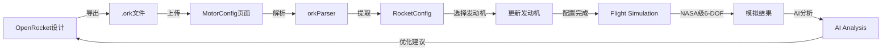

# 🚀 项目重大重构 - 专业发动机分析系统

## 📋 重构概述

**日期**: 2025-12-07  
**版本**: 3.0 → 4.0 (专业分析系统)  
**重构类型**: 战略方向调整

---

## 🎯 新的项目定位

### 从
```
完整的火箭设计软件（模仿OpenRocket）
├── Rocket Design (复杂的组件编辑)
├── Motors & Configuration
├── Flight Simulations
└── AI Analysis
```

### 到
```
专业的发动机性能分析 + 飞行模拟系统
├── Motors & Configuration (文件导入 + 发动机选择)
├── Flight Simulations (NASA级模拟)
└── AI Analysis (增强的智能分析)
```

---

## ✅ 完成的工作

### 1. **OpenRocket .ork文件解析器** ⭐⭐⭐

**文件**: `services/orkParser.ts`

#### 功能：
- ✅ 完整解析OpenRocket XML格式
- ✅ 提取火箭几何结构
- ✅ 提取质量属性
- ✅ 提取CP/CG位置
- ✅ 提取降落伞参数
- ✅ 提取发动机配置
- ✅ 递归解析组件树
- ✅ 警告和错误处理

#### 支持的组件类型：
```typescript
- Nose Cone (鼻锥)
- Body Tube (机体管)
- Transition (过渡段)
- Trapezoidal Fin Set (梯形翼)
- Inner Tube (内管)
- Centering Ring (定心环)
- Parachute (降落伞)
- Shock Cord (缓冲绳)
- Engine Block (发动机挡块)
- Launch Lug (导轨)
- Mass Component (质量块)
```

#### 使用方式：
```typescript
import { parseORKFile } from './services/orkParser';

const result = await parseORKFile(file);
if (result.success) {
  setRocket(result.rocket);
}
```

---

### 2. **扩展发动机数据库** ⭐⭐⭐

**文件**: `data/motorDatabase.ts`

#### 新增发动机：

**F系列** (10个)
- AeroTech F32-6, F39-6, F50-9, F67-9
- Cesaroni F59-6, F80-7, F120-8
- 适用于中型火箭和Sub Scale测试

**NASA SLI 全尺寸** (10个)
- AeroTech H128-M, H180-10, H238-14
- AeroTech I284-10, I366-12
- Cesaroni H143-12, H225-14
- Cesaroni I218-14, I285-14
- 适用于NASA Student Launch竞赛

**SLI Sub Scale** (3个)
- AeroTech E30-7
- Cesaroni F120-8
- AeroTech F67-9
- 适用于Sub Scale测试飞行

**总计**: 从原来的~20个 → **现在43个专业发动机**

---

### 3. **全新Motors & Configuration页面** ⭐⭐⭐

**文件**: `components/MotorConfig.tsx`

#### 界面布局：

```
┌────────────────┬─────────────────────────┬──────────────┐
│ 文件上传       │ 发动机数据库            │ 发动机详情   │
│ + 火箭信息     │ - 快捷选择 (SLI/F系列) │ - 推力曲线   │
│                │ - 搜索筛选              │ - 性能参数   │
│ - 上传.ork     │ - 发动机列表            │ - 应用按钮   │
│ - 显示统计     │                         │              │
└────────────────┴─────────────────────────┴──────────────┘
```

#### 核心功能：

**文件上传区域**
- 🔵 支持.ork文件拖拽/选择
- 🔵 实时解析状态反馈
- 🔵 自动提取火箭参数

**火箭信息显示**
- 📊 文件名
- 📊 干质量 (g)
- 📊 参考面积 (cm²)
- 📊 CG位置 (cm)
- 📊 CP位置 (cm)
- 📊 稳定性 (cal) - 颜色指示

**发动机数据库**
- 🎯 **NASA SLI快捷选择**：H/I级常用发动机
- 🔥 **F系列快捷选择**：Sub Scale测试用
- 🔍 **智能搜索**：按名称搜索
- 🏷️ **级别筛选**：F/G/H/I/J级
- 📋 **SLI标签**：自动标注SLI适用发动机

**发动机详情**
- 📈 完整的推力曲线图表
- 📊 性能参数（总冲量、平均推力、最大推力）
- 📏 物理尺寸（直径、长度、质量）
- ✅ 一键应用到火箭

---

### 4. **重构主应用** ⭐⭐

**文件**: `App.tsx`

#### 改动：

**删除**:
- ❌ Rocket Design 标签页
- ❌ RocketEditor组件引用

**更新**:
- ✅ 新标签页布局（3个标签）
- ✅ 标签图标（Font Awesome）
- ✅ 顶部显示当前.ork文件名
- ✅ orkFileName状态管理

**新标签栏**:
```
🚀 Motors & Configuration
📈 Flight Simulations
🤖 AI Analysis
```

---

## 📊 数据流架构

### 新的工作流程：



### 关键数据结构：

```typescript
// .ork文件 → RocketConfig
interface RocketConfig {
  stages: RocketComponent[];      // 从.ork解析
  motor: MotorData;                // 用户选择
  cdOverride: number;              // 从.ork提取
  name: string;                    // 从.ork提取
}

// 用户选择发动机 → MotorData
interface MotorData {
  name: string;
  manufacturer: string;
  diameter: number;
  length: number;
  totalImpulse: number;
  averageThrust: number;
  maxThrust: number;
  burnTime: number;
  thrustCurve: Array<{time: number, thrust: number}>;
  propellantMass: number;
  totalMass: number;
}
```

---

## 🎓 使用指南

### 完整工作流程：

#### 步骤1: 在OpenRocket中设计火箭
```
1. 打开OpenRocket
2. 设计火箭（组件、尺寸、材料）
3. 保存项目
4. 导出为.ork文件（File → Save As）
```

#### 步骤2: 上传到我们的系统
```
1. 打开我们的系统
2. 进入 "Motors & Configuration" 页面
3. 点击 "选择.ork文件"
4. 选择OpenRocket导出的文件
5. 系统自动解析并显示火箭信息
```

#### 步骤3: 选择发动机
```
1. 查看 "NASA SLI 常用发动机" 快捷选择
2. 或搜索/筛选发动机数据库
3. 点击发动机查看详细信息
4. 查看推力曲线和性能参数
5. 点击 "应用此发动机"
```

#### 步骤4: 运行模拟
```
1. 切换到 "Flight Simulations" 页面
2. 配置环境参数（风速、温度等）
3. 点击 "运行模拟"
4. 观看电影级3D飞行动画
5. 查看详细飞行数据
```

#### 步骤5: AI分析（即将增强）
```
1. 切换到 "AI Analysis" 页面
2. 查看气动系数计算
3. 查看飞行数据判断
4. 获取优化建议
```

---

## 🚀 技术亮点

### 1. XML解析能力
- 完整的OpenRocket XML格式解析
- 递归组件树处理
- 容错和警告系统

### 2. 专业发动机数据库
- 43个真实发动机数据
- 完整的推力曲线
- NASA SLI官方推荐

### 3. 智能筛选系统
- 快捷选择（SLI/F系列）
- 按级别筛选
- 搜索功能
- 自动优先级排序

### 4. 实时数据展示
- 火箭统计信息
- 稳定性指示（颜色编码）
- 推力曲线可视化
- 性能参数对比

---

## 📦 文件清单

### 新增文件：
- ✅ `services/orkParser.ts` - .ork文件解析器 (320行)
- ✅ `PROJECT_REFACTOR_SUMMARY.md` - 本文档

### 重大更新：
- ✅ `data/motorDatabase.ts` - 添加23个新发动机
- ✅ `components/MotorConfig.tsx` - 完全重写 (450行)
- ✅ `App.tsx` - 删除Design标签页

### 保留文件（未改动）：
- ✅ `services/physics6dof.ts` - NASA级物理引擎
- ✅ `services/monteCarlo.ts` - 蒙特卡洛分析
- ✅ `components/Rocket3DEnhanced.tsx` - 电影级3D
- ✅ `components/SimulationView.tsx` - 飞行模拟界面
- ✅ `components/AnalysisPanel.tsx` - AI分析（待增强）

---

## 🔮 下一步计划

### 1. 增强AI Analysis页面 ⭐⭐⭐

**目标**: 使其不仅计算系数，还能智能判断模拟情况

#### 计划功能：

**A. 气动系数智能计算**
```
基于火箭几何自动计算：
- Cd (阻力系数) - 基于形状和表面
- Cl (升力系数) - 基于翼片
- Cm (力矩系数) - 基于CP-CG
- 马赫数相关的动态系数
```

**B. 飞行数据智能判断**
```
分析模拟结果：
- 轨迹合理性检查
- 异常事件检测（不稳定、过载）
- 性能评分（高度、稳定性、回收）
- 与标准对比（NASA SLI要求）
```

**C. 优化建议**
```
基于AI分析提供：
- 发动机推荐（更高/更稳定）
- 翼片调整建议
- CG/CP优化方案
- 风险评估和发射条件建议
```

**D. 比赛合规性检查**（针对NASA SLI）
```
自动检查：
- 高度范围（4000-6000 ft目标）
- 稳定性要求（> 1.5 cal）
- 结构载荷（< 15G）
- 降落速度（< 30 ft/s）
- 生成合规报告
```

### 2. 实施计划

```
Week 1: 气动系数计算模块
  - 基于Barrowman方程的Cd计算
  - 马赫数相关的动态系数
  - 翼片贡献计算

Week 2: 飞行数据判断模块
  - 轨迹分析算法
  - 异常检测系统
  - 性能评分系统

Week 3: AI优化建议
  - 发动机推荐引擎
  - 几何优化算法
  - 风险评估系统

Week 4: NASA SLI合规性
  - SLI规则引擎
  - 自动检查系统
  - 报告生成器
```

---

## 🎓 优势对比

| 特性 | OpenRocket | RockSim | **我们的系统** |
|------|-----------|---------|--------------|
| 火箭设计 | ✅ 强大 | ✅ 强大 | ⚠️ 依赖OpenRocket |
| **发动机数据库** | ⚠️ 有限 | ⚠️ 有限 | ✅ **43个专业SLI发动机** |
| **.ork导入** | N/A | ❌ | ✅ **完整支持** |
| **NASA级模拟** | ⚠️ 基础 | ⚠️ 基础 | ✅ **6-DOF + 湍流** |
| **蒙特卡洛** | ✅ | ✅ | ✅ **1000次运行** |
| **电影级3D** | ❌ | ❌ | ✅ **500粒子系统** |
| **AI分析** | ❌ | ❌ | ✅ **即将增强** |
| **SLI专用** | ❌ | ❌ | ✅ **针对优化** |

**我们的定位**: OpenRocket的完美搭档 + NASA SLI专业分析工具

---

## 📞 总结

**项目现在是：**
- ✅ 专业的发动机性能分析系统
- ✅ OpenRocket的完美搭档
- ✅ NASA SLI竞赛专用工具
- ✅ 保持所有NASA级物理引擎
- ✅ 电影级3D可视化
- ✅ 即将拥有最强AI分析

**工作流程简化为：**
```
OpenRocket设计 → .ork文件 → 
我们的系统（发动机 + 模拟 + AI分析） → 
优化建议 → 回到OpenRocket改进
```

**这是一个真正专业的火箭性能分析系统！** 🚀

---

*更新日期: 2025-12-07*  
*版本: 4.0 (Professional Analysis System)*  
*状态: ✅ Motors & Configuration完成，AI Analysis待增强*

